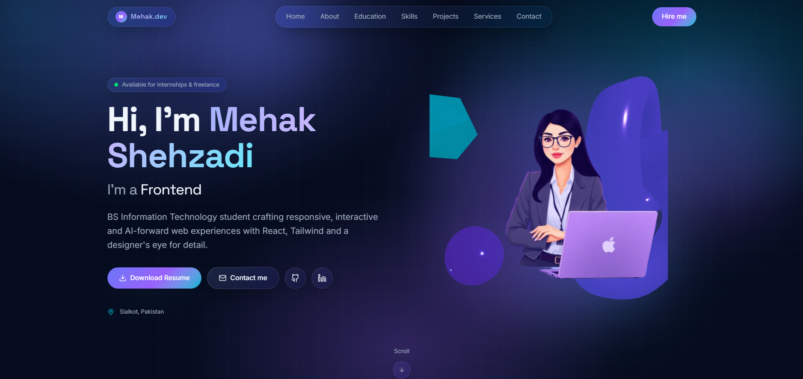
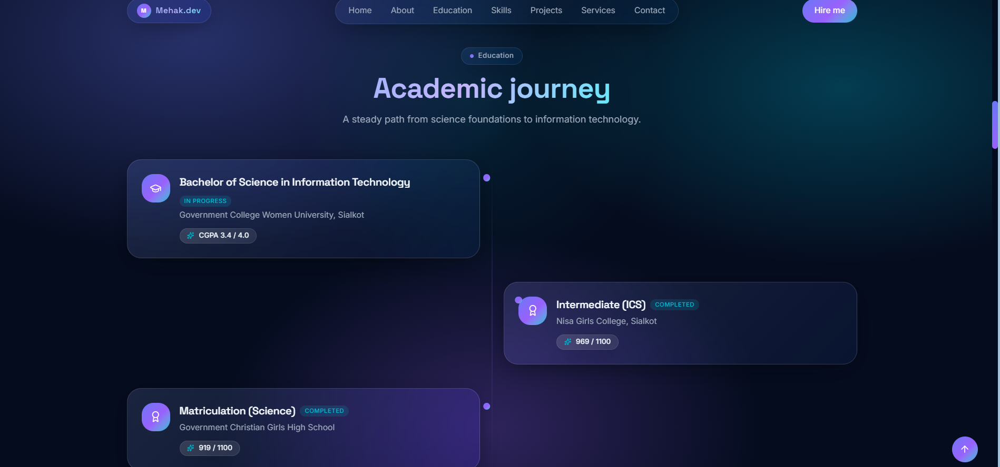
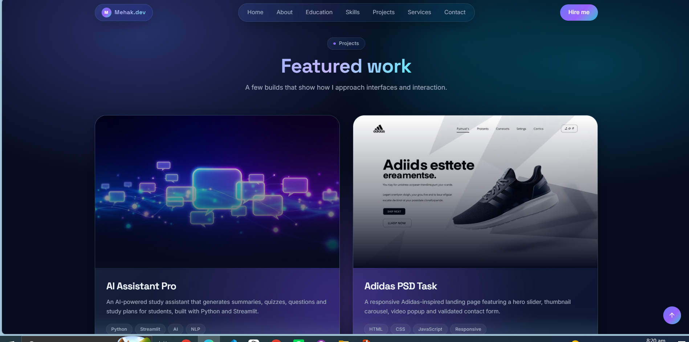
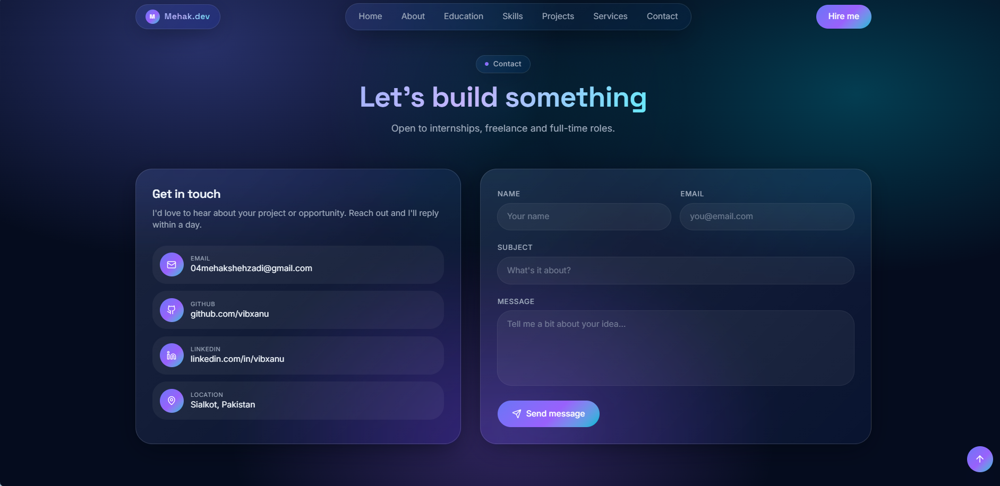

#  Mehak Shehzadi Portfolio

Welcome to my personal portfolio website! This project showcases my skills, experience, education, and featured projects as a Frontend Developer. It reflects my passion for building modern, responsive, and user-friendly web applications.

## Live Demo

🔗 https://mehak-shehzadi-portfolio.vercel.app/

##  Features

-  Modern & Responsive Design
-  Smooth Animations
- About Me Section
-  Education Timeline
-  Projects Showcase
-  Mobile Friendly Layout
-  Contact Form
- Clean and Interactive UI

##  Tech Stack

- React
- TypeScript
- Vite
- Tailwind CSS
- TanStack Start
- Framer Motion
- Supabase

##  Screenshots

###  Home

A modern and engaging landing page introducing my portfolio with a clean design and smooth animations.



---

###  Education

Displays my academic background and learning journey in a well-structured layout.



---

###  Projects

A collection of my featured projects with descriptions, technologies used, and live links.



---

###  Contact

A responsive contact section where visitors can easily connect with me.



---

##  Installation

Clone the repository:

```bash
git clone https://github.com/vibxanu/mehak-shehzadi-portfolio.git
```

Go to the project folder:

```bash
cd mehak-shehzadi-portfolio
```

Install dependencies:

```bash
npm install
```

Run the project:

```bash
npm run dev
```

##  Contact

- **GitHub:** https://github.com/vibxanu
- **LinkedIn:** https://www.linkedin.com/in/vibxanu
- **Portfolio:** https://mehak-shehzadi-portfolio.vercel.app/

---

 If you like this project, consider giving it a star on GitHub!
